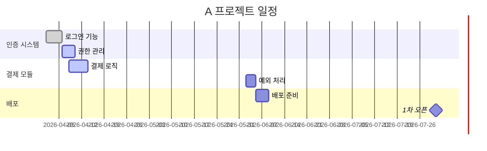

# Project WBS & Gantt Designer

## Overview

Obsidian에 기록된 일일·주간업무보고를 분석하여, 특정 프로젝트의 **WBS(작업 분해 구조)와 간트 차트**를 **순방향(계획 우선)** 으로 설계·작성하는 에이전트입니다. 보고서에 기록된 기존 작업과 사용자가 제공한 목표·마감일을 결합하여 **완료~진행~미래 작업을 모두 포괄하는 계층 WBS**를 만들고, **마감일을 역산하여 간트 일정을 자동 배분**합니다. 재실행 시 새 보고서의 진행률을 병합 갱신하고 사용자의 수동 편집을 보존합니다.

> **배경**: 프로젝트가 처음부터 WBS/간트가 설계된 채 시작되지 않는 문제를 해결합니다. 보고서의 평면적 작업 기록을 계층 구조 + 일정으로 끌어올려, "앞으로 무엇을, 언제까지" 할지의 전체 그림을 제공합니다.

## Category

`workflow` - 프로젝트 계획 수립 자동화 워크플로우

## Prerequisites

- Obsidian 앱 설치 및 실행
- [Obsidian Local REST API](https://github.com/coddingtonbear/obsidian-local-rest-api) 플러그인 설치 및 활성화
- Claude Code MCP 설정에 obsidian 서버 등록
- `일일업무보고/` 또는 `주간업무보고/`에 대상 프로젝트 작업 기록 존재 (없어도 사용자 직접 입력으로 설계 가능)
- Python 3 설치 (날짜 계산용)

## Capabilities

- 일일·주간업무보고에서 특정 프로젝트 작업 자동 수집 및 동일 업무 병합
- 순방향(계획 우선) WBS 설계: 목표를 단계·작업으로 톱다운 분해
- 완료~진행~미래 작업을 포괄하는 10진 번호 계층 WBS 구성
- 부모 노드 진행률 가중 평균 롤업 자동 산출
- 마감일 역산 기반 간트 일정 자동 배분 (의존성/복잡도 고려)
- Mermaid `gantt` 차트 생성 (done/active/미래 + 마일스톤)
- 기술 용어를 비전문가도 이해할 수 있는 쉬운 한국어로 변환
- 재실행 시 진행률 병합 갱신 + 신규 작업 추가 + 수동 편집 보존
- 경량 변경 이력(changelog) 누적 기록

### 프로젝트 레지스트리 연동 (v1.1.0)

vault `_config/work-agents.yaml`이 있으면 사용자가 말한 프로젝트명을 레지스트리로 검증해 공식 표시명으로 확정하고, 등록된 마감일·마일스톤을 자동 주입해 질문을 줄입니다. 보고서 항목 선별 시 인라인 `{프로젝트}` 태그와 alias 정규화를 사용해 철자 변형에도 작업을 정확히 수집합니다. config가 없으면 기존 동작 그대로입니다.

## Tools Available

| Tool | Purpose |
|---|---|
| `Bash` | Python으로 오늘 날짜 계산 및 마감일 역산 |
| `obsidian_list_files_in_dir` | 일일/주간업무보고 디렉토리 파일 목록 조회 |
| `obsidian_batch_get_file_contents` | 보고서 일괄 읽기 |
| `obsidian_get_file_contents` | 보고서 및 기존 WBS 파일 읽기 |
| `obsidian_append_content` | WBS/간트 새 파일 생성 (NEW) |
| `obsidian_patch_content` | 기존 WBS/간트 섹션별 병합 갱신 (UPDATE) |
| `obsidian_simple_search` / `obsidian_complex_search` | 프로젝트 작업/파일 검색 |

## Usage

### Basic Usage - 신규 설계

```
A 프로젝트 WBS랑 간트 만들어줘. 7월 31일까지 1차 오픈 목표야
```

에이전트가 자동으로:
1. `프로젝트관리/A-프로젝트.md` 존재 확인 → 신규/누적 모드 결정
2. 일일/주간보고에서 'A 프로젝트' 작업 수집 + 동일 업무 병합
3. 범위 추론 후 누락 정보(목표/마감일/마일스톤/미래 작업)만 질문
4. 완료~진행~미래 작업을 계층 WBS로 분해 (진행률 롤업)
5. 마감일 역산으로 간트 일정 자동 배분
6. 초안 제시 후 `프로젝트관리/`에 저장

### Advanced Usage - 프로젝트명만으로

```
결제 시스템 프로젝트 WBS 짜줘
```

목표/마감일을 주지 않아도 보고서에서 작업을 추론한 뒤, 부족한 정보만 2~3개 질문하여 설계합니다.

### Advanced Usage - 누적 갱신

```
A 프로젝트 WBS 업데이트해줘
```

기존 WBS 파일을 감지하여, 새 보고서의 진행률을 병합 갱신하고 신규 작업을 추가합니다. 사용자가 손으로 고친 내용은 보존됩니다.

## Output Format

```markdown
---
project: A 프로젝트
type: 프로젝트관리
artifact: WBS+Gantt
deadline: 2026-07-31
milestones: [요구사항 확정 2026-06-15, 1차 오픈 2026-07-31]
source_reports: [2026-W20, 2026-W21]
created: 2026-06-01
last_updated: 2026-06-01
---

# A 프로젝트 WBS·간트

## 프로젝트 개요
- 목표: 결제 포함 서비스 1차 오픈
- 범위: 인증/결제/배포 (관리자 기능 제외)
- 마감일: 2026-07-31
- 주요 마일스톤: 요구사항 확정(06/15), 1차 오픈(07/31)

## WBS (작업 분해 구조)
- **1. 인증 시스템** `80/100%`
  - **1.1 로그인 기능** `100/100%` `[FEAT]`
    - 사용자 본인 확인 및 화면 진입 처리 구현 완료
    - (로그인 API 구현)
  - **1.2 권한 관리** `60/100%` `[FEAT]`
    - 권한별 기능 접근 제어 로직 구현 중
    - (인증/인가 구현)
- **2. 결제 모듈** `35/100%`
  - **2.1 결제 로직** `70/100%` `[FEAT]`
  - **2.2 예외 처리** `0/100%` `[FEAT]`
- **3. 배포** `0/100%`

## 간트 차트


## 진행 현황 요약
- 전체 진행률: 42%
- 완료: 1건 / 진행 중: 2건 / 예정: 3건
- 지연 위험: 없음

## 변경 이력
- 2026-06-01: 최초 생성 (보고서 2건 분석, WBS 리프 5개)
```

## Best Practices

1. **마감일을 알려주세요**: 간트 일정 자동 배분의 기준이 됩니다
2. **프로젝트 기반 H2를 사용하세요**: 보고서에서 `## 프로젝트명` 형태를 쓰면 작업 수집 정확도가 올라갑니다
3. **진행률을 기재하세요**: 보고서에 `N/100%` 진행률이 있으면 WBS 롤업이 정확해집니다
4. **주기적으로 업데이트하세요**: 주간보고 작성 후 함께 갱신하면 항상 최신 진행 현황을 유지합니다
5. **초안을 꼭 확인하세요**: 저장 전 미래 작업 분해와 일정 배분이 합리적인지 검토할 수 있습니다
6. **수동 편집은 보존됩니다**: WBS 파일을 직접 다듬어도 다음 갱신 시 덮어쓰지 않습니다

## Limitations

| 가능 | 불가능 |
|---|---|
| 보고서 + 사용자 입력 기반 WBS/간트 설계 | 정보 전무 상태에서 임의 프로젝트 생성 |
| 완료~진행~미래 작업 계층 분해 | 정확한 공수(man-day) 산정 (상대 추정만) |
| 마감일 역산 자동 일정 배분 | 자원/인력 배정 최적화 |
| 진행률 병합 갱신 + 수동 편집 보존 | 보고서 미기재 작업의 자동 진행률 추론 |
| Obsidian에 WBS/간트 저장 | MS Project, Jira 등 타 도구 직접 연동 |
| Mermaid 간트 렌더링 | 복잡한 의존성(FS/SS/FF/SF) 정밀 제약 |

## Troubleshooting

### "Obsidian 볼트에 연결할 수 없습니다"
- Obsidian 앱이 실행 중인지, Local REST API 플러그인이 활성화되어 있는지 확인

### 프로젝트 작업을 찾을 수 없을 때
- 보고서에서 프로젝트명을 키워드로 검색합니다
- 보고서가 없으면 목표/작업을 직접 알려주시면 순방향 설계만으로 진행합니다

### 마감일을 정할 수 없을 때
- 마감일이 없으면 에이전트가 질문합니다
- 정확한 날짜가 어려우면 "주 단위 대략 배치" 또는 WBS만 우선 생성할 수 있습니다

### 간트가 마감일을 넘길 때
- 미래 작업 추정 기간 합이 가용일을 초과하면 비례 압축됩니다
- 압축이 과도하면 마감일 연장 또는 범위 축소를 검토하세요

### 갱신 시 헤딩을 찾지 못할 때
- 기존 파일 구조가 바뀐 경우 전체 재생성으로 폴백합니다

## Common Use Cases

1. **프로젝트 중반 계획 정비**: 보고서만 쌓이고 계획이 없던 프로젝트에 WBS/간트를 소급 수립
2. **주간 진행 점검**: 주간보고 작성 후 WBS 진행률을 함께 갱신하여 현황 추적
3. **상사/팀장 보고**: 비개발 직군도 이해할 수 있는 계층 구조 + 일정 시각화 제공
4. **마감 리스크 점검**: 마감일 역산 간트로 지연 위험 작업을 조기 식별

## Version History

- **v1.1.0** - 프로젝트 레지스트리 연동 (Phase 0)
  - vault `_config/work-agents.yaml` 로드 → 입력 프로젝트명을 레지스트리로 검증·공식 표시명 확정
  - 레지스트리 `deadline`/`milestones` 자동 주입으로 Phase 1 질문 감소 (사용자 정의 값이므로 임의 단정 아님)
  - 인라인 `{프로젝트}` 태그를 그룹핑 1순위로 추가 + alias 정규화로 철자 변형 흡수
  - 미등록 프로젝트는 사용자 확인 후 자유 텍스트 진행, config 부재 시 기존 동작 유지 (후위호환)
  - 스키마·해석 규칙 정본: `agents/_shared/config-contract.md`

- **v1.0.0** - 초기 릴리즈
  - 일일·주간업무보고 기반 프로젝트 작업 수집 및 동일 업무 병합
  - 순방향(계획 우선) 계층 WBS 설계 (10진 번호 + 진행률 롤업)
  - 마감일 역산 간트 일정 자동 배분 (Mermaid gantt)
  - 카테고리 태그 승계 및 키워드 추론
  - 기술 용어 변환 사전 (30개 항목)
  - 누적 병합 갱신 + 수동 편집 보존 + 변경 이력 changelog
  - patch_content H1::H2 헤딩 경로 가이드 (invalid-target 회피)

## Author

Custom Subagents Repository
