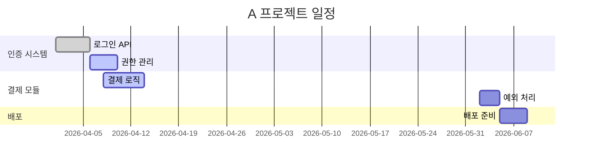

# 프로젝트 WBS·간트 설계기 (project-wbs-gantt-designer) 설계 문서

- 작성일: 2026-06-01
- 상태: 승인됨 (설계 확정)
- 위치: `agents/workflow/project-wbs-gantt-designer/`

## 1. 배경 및 문제

현재 프로젝트들은 **WBS(작업 분해 구조)나 간트 차트가 처음부터 설계·기획된 상태로 시작되지 않는다.** 그 결과 "앞으로 무엇을, 언제까지 해야 하는가"의 전체 그림이 없고, 진행 상황을 구조적으로 추적하기 어렵다.

일일업무보고(`일일업무보고/`)와 주간업무보고(`주간업무보고/`)에는 "한 일/진행 중/할 일"과 진행률은 기록되지만, 이는 **이미 한 작업의 평면적 나열**일 뿐 계층적 분해 구조나 마감일 기준 일정이 아니다.

본 에이전트는 사용자가 "A 프로젝트의 WBS/간트 만들어줘"라고 하면, 보고서 분석 + 사용자 입력을 결합하여 **순방향(계획 우선) WBS + 간트 차트**를 설계·작성하고, 이후 보고서 진행률을 **누적 병합 갱신**한다.

## 2. 핵심 결정 사항

| 항목 | 결정 | 비고 |
|---|---|---|
| 산출물 | WBS + 간트 연계 (한 파일) | WBS 분해 → 동일 작업을 간트 일정으로 연결 |
| 생성 방향 | 순방향 설계 (계획 우선) | 미래 작업까지 톱다운 기획 |
| 범위 확보 | 사용자 직접 입력 + 에이전트 추론 병행 | 보고서 추론 후 누락분만 2~3개 인터뷰 |
| 일정 산정 | 마감일 역산 + 자동 배분 | 완료=실적 날짜, 미래=오늘~마감 구간 자동 배치 |
| 저장 위치 | `프로젝트관리/{프로젝트}.md` | 프로젝트별 1파일 |
| 누적 동작 | 병합 갱신 + 수동 편집 보존 | + 경량 변경 이력 changelog |
| 아키텍처 | 독립 에이전트 신설 | reporter family 패턴/자산 재사용 |

## 3. 동작 흐름 (4단계)

### Phase 1 — 프로젝트 식별 & 범위 확보

1. 사용자 지정 프로젝트명 파악 (예: "A 프로젝트 WBS 만들어줘").
2. `프로젝트관리/{프로젝트}.md` 존재 여부 확인 → **NEW(신규)** vs **UPDATE(누적)** 모드 결정.
   - `obsidian_get_file_contents`로 확인, 404 → NEW, 존재 → UPDATE.
3. (NEW 모드) 일일/주간보고에서 해당 프로젝트 항목 수집.
   - `obsidian_list_files_in_dir` + `obsidian_batch_get_file_contents`로 `일일업무보고/`, `주간업무보고/` 읽기.
   - **프로젝트 그룹핑 로직 재사용** (weekly-work-reporter Phase 2):
     1. 프로젝트 기반 H2 헤더(예: `## ATL AXIS Frontend`)
     2. frontmatter `project`/`focus_project` 필드
     3. 항목 괄호 원문/제목의 프로젝트 키워드
   - 사용자가 프로젝트명과 매칭되는 항목만 추려 "기존 완료/진행 작업" 목록 구성.
4. 수집 결과로 목표·기존 산출물·진행분 **추론**.
5. 부족한 정보만 사용자에게 **2~3개 질문**: 최종 목표, 마감일, 주요 마일스톤, 미래 산출물.
   - 사용자가 처음부터 직접 입력한 목표/범위/마감일이 있으면 우선 반영하고 질문 생략.

### Phase 2 — WBS 설계 (순방향)

6. 완료/진행 작업(보고서 기반) + 미래 작업(목표에서 톱다운 분해)을 합쳐 계층 구성.
   - 10진 번호 체계: `1` → `1.1` → `1.1.1`, 최대 3~4 레벨.
   - 레벨1 = 주요 산출물/단계(phase), 리프 = 실제 작업 단위.
7. 리프 노드 메타데이터:
   - 진행률: 보고서 매핑값(시작값→최종값 추적 결과의 최종값), 미래 작업은 `0/100%`.
   - 카테고리 태그(`[FEAT]/[BUG]/[REFACTOR]/[OPS]/[DOC]/[QA]`): 보고서 항목에서 승계, 미래 작업은 추론.
8. 부모 노드 진행률 = **리프 가중 평균** 자동 산출.
   - 가중치 = 해당 부모 하위의 리프 개수. (리프 진행률 합 / 리프 개수, 10% 단위 반올림)

### Phase 3 — 간트 차트 (마감일 역산 + 자동 배분)

9. 작업별 일정 산정:
   - **완료 작업**: 보고서 실제 날짜 사용 → `done`. 시작일 = 최초 등장일, 종료 = 완료(100%) 등장일.
   - **진행 작업**: 최근 등장일 ~ 현재(오늘) → `active`.
   - **미래 작업**: 오늘 ~ 마감일 구간에 **WBS 순서/의존성대로 자동 배치**.
     - 기간 추정 = 복잡도(하위 항목 수) 기반. 기본 1일 + (하위 bullet 수 × 0.5일), 상한 적용.
     - 마감일까지 총 가용일을 초과하면 비례 압축하여 마감일 내 수렴.
10. Mermaid `gantt` 작성:
    - `dateFormat YYYY-MM-DD`, `section` = WBS 레벨1 그룹.
    - 상태 태그: `done` / `active` / (미래는 기본).
    - 마일스톤은 `milestone` 키워드로 표기.
11. 날짜 계산은 Bash + Python 원라이너 사용 (weekly-work-reporter 패턴 재사용).

### Phase 4 — 확인 & 저장

12. 초안 전체를 화면에 출력 → 사용자 확인. 수정 요청 시 반영 후 재제시.
13. 모드별 저장:
    - **NEW**: `obsidian_append_content`로 `프로젝트관리/{프로젝트}.md` 생성 (디렉토리 자동 생성).
    - **UPDATE**: `obsidian_patch_content`로 섹션별 replace.
      - target은 **H1::H2 헤딩 경로** 필수 (단순 H2는 invalid-target). 예: `"A 프로젝트 WBS·간트::WBS (작업 분해 구조)"`.
      - 실패 시 `append_content` 폴백.
14. 저장 경로 + 핵심 요약(전체 진행률, 완료/진행/예정 건수) 안내.

## 4. 출력 파일 구조

```
---
project: A 프로젝트
type: 프로젝트관리
artifact: WBS+Gantt
deadline: 2026-07-31
milestones: [요구사항 확정 2026-06-15, 1차 오픈 2026-07-15]
source_reports: [2026-W20, 2026-W21]
created: 2026-06-01
last_updated: 2026-06-01
---

# A 프로젝트 WBS·간트

## 프로젝트 개요
- 목표: [한 줄 목표]
- 범위: [포함/제외]
- 마감일: YYYY-MM-DD
- 주요 마일스톤: [목록]

## WBS (작업 분해 구조)
- **1. 인증 시스템** `80/100%`
  - **1.1 로그인 API** `100/100%` `[FEAT]`
    - [쉬운 설명 명사형 종결]
    - (로그인 API 구현)
  - **1.2 권한 관리** `60/100%` `[FEAT]`
- **2. 결제 모듈** `35/100%`
  - **2.1 결제 로직** `70/100%` `[FEAT]`
  - **2.2 예외 처리** `0/100%` `[FEAT]`
- **3. 배포** `0/100%`

## 간트 차트


## 진행 현황 요약
- 전체 진행률: NN%
- 완료: N건 / 진행 중: N건 / 예정: N건
- 지연 위험: [마감일 대비 빠듯한 작업 목록 또는 "없음"]

## 변경 이력
- 2026-06-01: 최초 생성 (보고서 2건 분석, WBS 리프 8개)
```

> **변경 이력**: "누적" 요구를 반영하는 경량 changelog. 회차별 변경(진행률 갱신, 신규 작업 추가)을 1줄씩 누적 기록. 스냅샷 이력(별도 파일/날짜별 사본)은 채택하지 않음.

## 5. 누적(UPDATE) 동작 상세

1. 새 보고서 읽기 → 기존 WBS 리프와 매칭.
   - **1순위**: 괄호 안 기술 용어 동일 → 같은 작업.
   - **2순위**: 제목 의미 동일 → 같은 작업. (weekly-work-reporter 동일 업무 판별 재사용)
2. 매칭 항목 진행률 갱신, 100% 도달 시 완료 표시.
3. 미매칭 신규 작업 → best-fit 부모 노드 아래 추가.
   - 부모 추론 불가/모호 시 사용자에게 배치 위치 확인.
4. 간트 날짜 재계산: 완료분은 확정(고정), 미래분은 오늘~마감 구간 재배분.
5. **수동 편집 보존**: 사용자가 손으로 추가/수정한 노드·날짜·설명·구조는 덮어쓰지 않음.
   - 진행률만 변경된 경우 설명 텍스트 유지.
6. 변경 이력 섹션에 1줄 추가.

## 6. 재사용 자산 (reporter family)

- 기술 용어 변환 사전(37~40개) + 명사형 종결 규칙 + 변환 규칙.
- 프로젝트 그룹핑 / 동일 업무 판별 / 진행률 추적(시작값→최종값).
- 카테고리 태그 체계 및 키워드 휴리스틱.
- Mermaid 차트 작성 규칙 + Obsidian `patch_content` H1::H2 경로 패턴.
- 에러 핸들링(Obsidian 연결 실패, 파일 없음, Python 실행 불가, 저장 실패, 헤딩 미발견).

## 7. 산출물 파일 (3종)

`agents/workflow/project-wbs-gantt-designer/`:
- `project-wbs-gantt-designer.md` — 시스템 프롬프트 (Role/Expertise/Working Process/형식/Constraints 등, reporter family 구조 준수).
- `agent.json` — 메타데이터 (name/type/description/category/version/tools/capabilities/tags/examples).
- `README.md` — 사용법/예시/입출력 설명.

### agent.json 도구 목록

```
Bash,
mcp__obsidian__obsidian_list_files_in_dir,
mcp__obsidian__obsidian_batch_get_file_contents,
mcp__obsidian__obsidian_get_file_contents,
mcp__obsidian__obsidian_append_content,
mcp__obsidian__obsidian_patch_content,
mcp__obsidian__obsidian_simple_search,
mcp__obsidian__obsidian_complex_search
```

## 8. 제약 및 금지 (reporter family 일관)

- 한국어 + 명사형 종결 필수, 어미형 종결 금지.
- 기술 용어 단독 사용 금지 (쉬운 설명 + 괄호 원문).
- 보고서 원본 수정/삭제 금지 (읽기 전용).
- 저장 전 사용자 확인 필수.
- UPDATE 시 수동 편집/기존 내용 삭제 금지 (병합만).
- Mermaid 펜스 외 코드 블록 금지.
- 보고서에 없고 사용자가 주지 않은 작업의 임의 창작 금지 (단, 목표에서 톱다운 분해한 미래 작업은 허용 — 사용자 확인 대상).

## 9. 성공 기준

- 사용자가 프로젝트명만 줘도 보고서 분석 + 누락분 인터뷰로 WBS+간트 초안 생성.
- WBS가 완료/진행/미래 작업을 계층적으로 포괄하고 진행률 롤업이 정확함.
- 간트가 마감일을 넘기지 않고 의존성 순서대로 배치됨.
- 재실행 시 진행률이 병합 갱신되고 수동 편집이 보존됨.
- `프로젝트관리/{프로젝트}.md`에 올바르게 저장되고 Mermaid가 Obsidian에서 렌더링됨.
